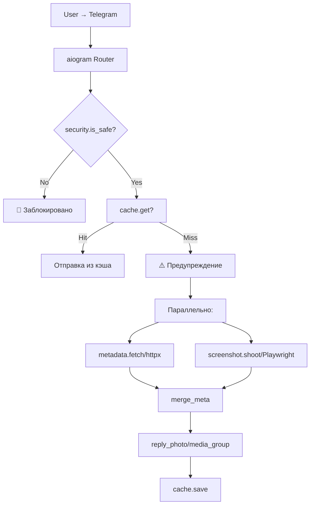

# 🖼️ Telegram Screenshot Bot

Telegram-бот для безопасного предпросмотра ссылок. Отправляет скриншот веб-страницы и текстовую карточку с метаданными, чтобы пользователь не переходил по подозрительным ссылкам.

---

## ✨ Возможности

- 🔗 **Мгновенное предупреждение** — до генерации скриншота бот предупреждает о потенциальной опасности
- 📱 **Мобильный вид** — скриншоты в разрешении 390×844 (@2x) для реалистичного отображения
- 🖼️ **Полная страница** — снимает всю страницу и нарезает на части (до 5120 px)
- 🏷️ **Метаданные** — извлекает title, description, price, brand, rating (JSON-LD Schema.org)
- 🛡️ **SSRF-защита** — блокирует запросы к приватным IP-адресам
- 💾 **Кэширование** — TTLCache для file_id отправленных фото
- 🚫 **Блокировка рекламы** — отключает загрузку трекеров и рекламных скриптов
- 🔧 **Оптимизация под 512 МБ RAM** — SEMAPHORE=1, управление памятью

---

## 🏗️ Архитектура

MIT License

Copyright (c) 2026 Tosik017

Permission is hereby granted, free of charge, to any person obtaining a copy
of this software and associated documentation files (the "Software"), to deal
in the Software without restriction, including without limitation the rights
to use, copy, modify, merge, publish, distribute, sublicense, and/or sell
copies of the Software, and to permit persons to whom the Software is
furnished to do so, subject to the following conditions:

The above copyright notice and this permission notice shall be included in all
copies or substantial portions of the Software.

THE SOFTWARE IS PROVIDED "AS IS", WITHOUT WARRANTY OF ANY KIND, EXPRESS OR
IMPLIED, INCLUDING BUT NOT LIMITED TO THE WARRANTIES OF MERCHANTABILITY,
FITNESS FOR A PARTICULAR PURPOSE AND NONINFRINGEMENT. IN NO EVENT SHALL THE
AUTHORS OR COPYRIGHT HOLDERS BE LIABLE FOR ANY CLAIM, DAMAGES OR OTHER
LIABILITY, WHETHER IN AN ACTION OF CONTRACT, TORT OR OTHERWISE, ARISING FROM,
OUT OF OR IN CONNECTION WITH THE SOFTWARE OR THE USE OR OTHER DEALINGS IN THE
SOFTWARE.

### 📝 In short:

You are free to do almost anything with this software, but there are a few basic rules.

* **You can:** Use, modify, copy, distribute, and even sell the code for any purpose (including commercial projects).
* **You must:** Keep the original copyright notice and the license text included in your project.
* **You cannot:** Hold the author (Tosik017) liable for any damages, bugs, or issues. The software is provided "as is," at your own risk.

> *"Do whatever you want with the code, just give me credit and don't sue me if something breaks."*

---

---

## 7. Рекомендуемые улучшения проекта

### 🔴 Критически важные

| Улучшение | Причина | Эффект | Сложность | Пример |
|-----------|---------|--------|-----------|--------|
| **Добавить LICENSE** | Отсутствует лицензия — код не может быть легально использован | Юридическая защита авторских прав, возможность форков | Low | `MIT` или `Apache 2.0` |
| **Добавить .dockerignore** | Уменьшает размер образа, исключает ненужные файлы | Быстрее сборка, меньше размер образа | Low | `__pycache__`, `.git`, `*.pyc` |
| **Добавить .env.example** | Упрощает настройку для новых пользователей | Лучший UX для деплоя | Low | `BOT_TOKEN=your_token_here` |
| **Добавить .gitignore** | Исключает секреты и временные файлы | Безопасность, чистота репозитория | Low | `.env`, `__pycache__`, `.venv` |
| **Rate limiting per user** | Защита от флуда и abuse | Стабильность бота, защита от DoS | Medium | Middleware на 1 запрос/5 сек |
| **Browser restart loop** | Playwright memory leaks [GitHub Issue #15400](https://github.com/microsoft/playwright/issues/15400) | Предотвращение OOM, стабильность 24/7 | Medium | Перезапуск после 100 запросов |
| **Healthcheck endpoint** | `/ping` не проверяет состояние бота | Реальная проверка работоспособности | Low | Проверка `_browser is not None` |

### 🟡 Желательные

| Улучшение | Причина | Эффект | Сложность | Пример |
|-----------|---------|--------|-----------|--------|
| **Персистентный кэш (Redis)** | TTLCache теряется при рестарте | Кэш сохраняется, меньше нагрузка | Medium | `redis.asyncio` |
| **SSRF защита после редиректов** | DNS rebinding attack | Безопасность | Medium | Проверка `httpx` response URL |
| **Webhook mode** | Polling имеет задержки | Быстрый ответ, меньше нагрузка на API | Medium | `set_webhook` + FastAPI endpoint |
| **Graceful shutdown** | SIGTERM не обрабатывается | Корректное завершение, сохранение состояния | Medium | `signal.signal` handler |
| **Structured logging (JSON)** | Лучше для production monitoring | Интеграция с ELK/Loki | Low | `loguru` JSON formatter |
| **Docker multi-stage build** | Меньше размер образа | Быстрее деплой, меньше attack surface | Medium | Separate build/runtime stages |
| **Dependabot/ Renovate** | Автоматическое обновление зависимостей | Безопасность, актуальность | Low | `.github/dependabot.yml` |

### 🟢 Необязательные

| Улучшение | Причина | Эффект | Сложность | Пример |
|-----------|---------|--------|-----------|--------|
| **PDF экспорт** | Запрос от пользователей | Дополнительная функциональность | Medium | `page.pdf()` |
| **Inline mode** | Поиск и выбор через inline query | UX улучшение | Medium | `@bot inline_query` |
| **Database (PostgreSQL)** | Статистика, история запросов | Аналитика, rate limiting | High | `asyncpg` |
| **Admin panel** | Управление ботом через веб | Удобство администрирования | High | FastAPI + SQLAdmin |
| **i18n (многоязычность)** | Поддержка других языков | Широкая аудитория | Medium | `fluent` или `i18n` |
| **Sentry integration** | Отслеживание ошибок | Быстрое обнаружение проблем | Low | `sentry-sdk` |
| **Prometheus метрики** | Мониторинг производительности | Observability | Medium | `prometheus-client` |

---

## 8. Итоговые выводы

### Общая оценка проекта

**Сильные стороны**:
- ✅ Продуманная архитектура под ограниченные ресурсы (512 МБ RAM)
- ✅ Использование `dumb-init` для предотвращения zombie-процессов
- ✅ Параллельный сбор метаданных и скриншотов
- ✅ Оптимизация Playwright (блокировка рекламы, медиа, шрифтов)
- ✅ SSRF-защита базового уровня
- ✅ FastAPI health check endpoint

**Области для улучшения**:
- ⚠️ Отсутствие LICENSE, .gitignore, .dockerignore
- ⚠️ Нет rate limiting — уязвимость к флуду
- ⚠️ Нет персистентного кэша (Redis)
- ⚠️ Нет periodic browser restart — риск OOM
- ⚠️ SSRF-защита не покрывает DNS rebinding

### Рекомендуемый путь деплоя

1. **Разработка**: Docker локально / Docker Compose
2. **Тестирование**: Render Free (проверка работоспособности)
3. **Production 24/7 (бесплатно)**: Oracle Cloud Always Free ARM (4 OCPU, 24 ГБ RAM)
4. **Production 24/7 (платно, стабильно)**: Hetzner CX22 (€5.99/мес) или CX42

### Ключевые источники

- [Playwright Memory Leaks GitHub Issue #15400](https://github.com/microsoft/playwright/issues/15400) — подтверждение проблемы с утечками памяти
- [Playwright Zombie Processes GitHub Issue #34190](https://github.com/microsoft/playwright/issues/34190) — подтверждение необходимости dumb-init
- [Render Free Tier Docs](https://render.com/docs/free) — официальные лимиты Render
- [Hetzner Cloud Pricing](https://www.hetzner.com/cloud) — актуальные цены
- [Oracle Cloud Free Tier](https://www.oracle.com/cloud/free/) — Always Free tier спецификации
- [Uptime Kuma GitHub](https://github.com/louislam/uptime-kuma) — self-hosted monitoring
- [Gotenberg GitHub](https://github.com/gotenberg/gotenberg) — пример production-ready архитектуры
- [Browserless GitHub](https://github.com/browserless/browserless) — пример managed browser pool

---

📝 Краткий итог:
"Вы можете делать с моим кодом всё, что захотите, в том числе использовать его в коммерческих целях. Просто не удаляйте моё имя из файла лицензии и не вините меня, если из-за моего кода у вас что-то сломается."

