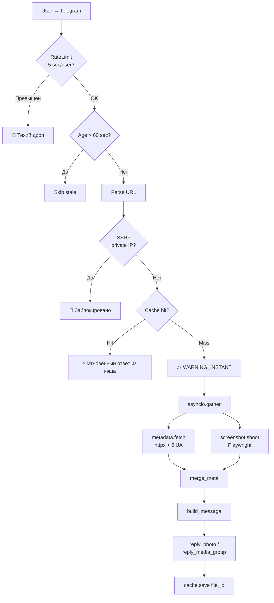

# 🛡️ Telegram Screenshot Bot

[](https://www.python.org/)
[](https://www.docker.com/)
[](https://playwright.dev/)
[](LICENSE)
[](https://github.com/Tosik017/tg-screenshot-bot-1/releases/tag/stable-v1)

Telegram-бот для **безопасного предпросмотра ссылок**. Вместо того чтобы переходить по подозрительной ссылке, пользователь отправляет её боту и получает скриншот страницы + текстовую карточку с метаданными.

Оптимизирован под **Render Free (512 МБ RAM, 0.1 CPU)** и разворачивается одним кликом.

---

## ✨ Возможности

### 🚨 Защита пользователя
- **Мгновенное предупреждение** ещё до генерации скриншота — пользователь видит что нужно подождать и не переходить по ссылке
- **SSRF-фильтр** — блокирует обращения к приватным IP-диапазонам (`127.0.0.0/8`, `10.0.0.0/8`, `172.16.0.0/12`, `192.168.0.0/16`, link-local, multicast, IPv6 private)
- **Текстовая карточка** с метаданными: site_name, title, brand, price, rating, description (OpenGraph + Twitter Cards + JSON-LD Schema.org Product)
- **Disclaimer-цитата** в каждой карточке — напоминание не вводить пароли и данные карт

### ⚡ Производительность
- **Параллельный сбор** — `asyncio.gather` запускает метаданные (httpx) и скриншот (Playwright) одновременно
- **Browser restart каждые 50 скриншотов** — защита от утечек памяти Playwright (V8 heap, internal page cache)
- **In-memory кэш file_id** — повторные запросы той же ссылки отдаются мгновенно (TTL 5 минут, 200 записей)
- **Нарезка длинных страниц** через Pillow на части до 5120 px (4 × 1280)
- **Блокировка рекламы, медиа, шрифтов, аналитики** в Playwright — ускоряет загрузку и экономит RAM
- **Мобильный viewport** 390 × 844 @ 2× DPR — реалистичные скриншоты

### 🛡️ Стабильность
- **Rate limiting** — 5 секунд между запросами от одного user_id, тихий дроп без спама в чат
- **dumb-init** в Docker — предотвращает zombie-процессы Chromium
- **Фильтр бэклога** — игнорирует сообщения старше 60 секунд (защита от спама после рестарта)
- **`delete_webhook(drop_pending_updates=True)`** — сброс накопленной очереди апдейтов при старте
- **healthcheck `/ping`** для Render

### 🌐 Обход блокировок
- **5 User-Agent fallback** для httpx — Slackbot, Twitterbot, facebookexternalhit, 2× Chrome
- **playwright-stealth** — скрытие признаков headless-браузера
- **Автоматическое закрытие cookie-баннеров** — 7 паттернов селекторов
- **Slackbot UA обходит Cloudflare** — метаданные извлекаются даже когда Playwright блокируется

### 🧠 Умный парсинг
- **JSON-LD Schema.org Product** — корректно извлекает цену, бренд, рейтинг
- **Обход `@graph`** — фикс для Elmir, Rozetka, Comfy, которые прячут Product не первым объектом
- **merge_meta** — объединяет данные из httpx (Cloudflare-friendly) и Playwright (JS-рендер), берёт более полные значения

---

## 🏗️ Архитектура



---

## 🛠️ Стек технологий

| Компонент | Версия | Роль |
|-----------|--------|------|
| Python | 3.12 | Базовый язык |
| aiogram | 3.7.0 | Telegram Bot API, async-first |
| Playwright | 1.44.0 | Headless Chromium для скриншотов |
| playwright-stealth | 1.0.6 | Обход headless-detection |
| FastAPI | 0.111.0 | HTTP-сервер для healthcheck |
| uvicorn | 0.30.0 | ASGI сервер |
| httpx | 0.27.0 | Async HTTP для метаданных |
| selectolax | 0.3.21 | C-парсер HTML (~30× быстрее BeautifulSoup) |
| cachetools | 5.3.3 | In-memory TTL кэш |
| loguru | 0.7.2 | Структурированное логирование |
| Pillow | 10.3.0 | Нарезка скриншотов |
| psutil | 5.9.8 | Мониторинг RAM |

---

## 📁 Структура проекта

```
tg-screenshot-bot-1/
├── bot.py              # Обработка сообщений, RateLimitMiddleware, build_message
├── main.py             # Точка входа, Playwright init, polling + FastAPI
├── screenshot.py       # Playwright: shoot(), browser restart, нарезка
├── metadata.py         # httpx + selectolax: fetch(), JSON-LD парсинг
├── security.py         # SSRF: блокировка private IP
├── cache.py            # TTLCache обёртка
├── config.py           # ENV vars + константы
├── Dockerfile          # Playwright base image + dumb-init
├── render.yaml         # Render Blueprint
├── requirements.txt
├── .env.example
├── .gitignore
├── .dockerignore
├── LICENSE
└── README.md
```

---

## 📋 Требования

- **Python** 3.12+
- **Docker** 20+ (для контейнерного запуска)
- **RAM** ≥ 512 МБ
- **CPU** ≥ 1 core (Playwright требователен)
- **BOT_TOKEN** от [@BotFather](https://t.me/BotFather)

---

## 🚀 Быстрый старт

### Получение Telegram Bot Token

1. Откройте Telegram и найдите [@BotFather](https://t.me/BotFather)
2. Отправьте `/newbot`, укажите имя и username (должен заканчиваться на `bot`)
3. Скопируйте токен формата `123456789:ABCdefGHIjklMNOpqrsTUVwxyz`

### Docker (рекомендуется)

```bash
git clone https://github.com/Tosik017/tg-screenshot-bot-1.git
cd tg-screenshot-bot-1

docker build -t tg-screenshot-bot .

docker run -d \
  --name tg-screenshot-bot \
  --restart unless-stopped \
  -e BOT_TOKEN="YOUR_BOT_TOKEN_HERE" \
  -p 8000:8000 \
  tg-screenshot-bot
```

### Docker Compose

```yaml
version: '3.8'
services:
  bot:
    build: .
    container_name: tg-screenshot-bot
    restart: unless-stopped
    mem_limit: 512m
    environment:
      - BOT_TOKEN=${BOT_TOKEN}
      - PORT=8000
    ports:
      - "8000:8000"
    healthcheck:
      test: ["CMD", "curl", "-f", "http://localhost:8000/ping"]
      interval: 30s
      timeout: 10s
      retries: 3
      start_period: 60s
```

```bash
echo "BOT_TOKEN=YOUR_BOT_TOKEN_HERE" > .env
docker-compose up -d
```

### Локальный запуск (без Docker)

```bash
git clone https://github.com/Tosik017/tg-screenshot-bot-1.git
cd tg-screenshot-bot-1

python -m venv venv
source venv/bin/activate

pip install -r requirements.txt
playwright install chromium

export BOT_TOKEN="YOUR_BOT_TOKEN_HERE"
python main.py
```

---

## ☁️ Деплой на Render

1. Форкните репозиторий на GitHub
2. На [render.com](https://render.com) → **New +** → **Web Service**
3. Выберите ваш форк, Runtime: **Docker**, Branch: `main`
4. В **Environment** добавьте: `BOT_TOKEN` = ваш токен
5. **Health Check Path**: `/ping`
6. **Create Web Service**

⚠️ **Ограничения Render Free**:
- 750 часов/месяц
- Sleep после 15 минут idle, cold start 30–60 сек
- 512 МБ RAM, 0.1 CPU
- Ephemeral диск (данные не сохраняются между рестартами)

---

## 🖥️ Деплой на VPS (Ubuntu 22.04)

```bash
sudo apt update && sudo apt install -y docker.io docker-compose
sudo systemctl enable --now docker

git clone https://github.com/Tosik017/tg-screenshot-bot-1.git
cd tg-screenshot-bot-1
echo "BOT_TOKEN=YOUR_BOT_TOKEN_HERE" > .env
docker-compose up -d
```

---

## 🔐 Переменные окружения

| Переменная | Обязательная | Описание | По умолчанию |
|------------|--------------|----------|--------------|
| `BOT_TOKEN` | ✅ | Токен от @BotFather | — |
| `PORT` | ❌ | Порт для FastAPI сервера | `8000` |

---

## ⚙️ Конфигурация

Все константы в `config.py` и `screenshot.py`:

| Константа | Значение | Зачем |
|-----------|----------|-------|
| `SEMAPHORE` | 1 | Один скриншот одновременно — два Chromium = OOM на 512 МБ |
| `TIMEOUT_MS` | 20 000 | Таймаут навигации Playwright (20 сек) |
| `PAUSE_MS` | 3 000 | Пауза после `domcontentloaded` для JS-рендера |
| `MAX_PARTS` | 4 | Макс. частей при нарезке (защита от OOM) |
| `PART_HEIGHT` | 1 280 | Высота одной части (Telegram лимит ~10 МБ на фото) |
| `MAX_HEIGHT` | 5 120 | `PART_HEIGHT × MAX_PARTS`, обрезка длинных страниц |
| `MAX_MSG_AGE` | 60 сек | Фильтр бэклога после рестарта |
| `RATE_LIMIT_SEC` | 5 сек | Между запросами от одного user_id |
| `RESTART_EVERY` | 50 | Скриншотов между перезапусками браузера |
| `CACHE_SIZE` | 200 | Записей в TTLCache |
| `CACHE_TTL` | 300 сек | Время жизни записи (5 минут) |
| `MOBILE_WIDTH` × `MOBILE_HEIGHT` | 390 × 844 @ 2× | Mobile viewport |

---

## 📝 Использование

### Базовый сценарий

1. Отправьте боту ссылку: `https://example.com`
2. Бот мгновенно отвечает: **"🚨⚠️ СТОП! НЕ ПЕРЕХОДЬТЕ ЗА ПОСИЛАННЯМ!"**
3. Через 5–60 секунд получаете:
   - Скриншот страницы (одно фото или медиагруппа из 2–4 частей)
   - Карточку: site_name, title, brand, price, rating, description
   - Disclaimer в виде цитаты

### Реакции бота

| Ситуация | Ответ |
|----------|-------|
| Нормальная ссылка | Скриншот + текстовая карточка |
| Cloudflare-сайт | Только текстовая карточка (метаданные через httpx) |
| Приватный IP | `🚫 Посилання веде на недоступний ресурс.` |
| Превышен rate limit | Тихий дроп (логируется как `RATE_LIMIT user=... cooldown=...s`) |
| Сообщение без URL | Бот молчит |
| Сообщение старше 60 сек | Skip (защита от бэклога) |
| Ошибка обработки | `❌ Не вдалось обробити посилання.` |

### Healthcheck

```bash
curl https://your-bot.onrender.com/ping
# {"ok": true}
```

---

## 🔧 Troubleshooting

### TelegramConflictError при деплое

**Причина**: Старый инстанс ещё не умер, новый уже стартует — оба пытаются получать апдейты.

**Решение**:
- Render Dashboard → **Manual Deploy** → **Deploy latest commit**
- Или: Settings → **Suspend** → подождать 10 сек → **Resume**
- Или: `git commit --allow-empty -m "restart" && git push`

### Бот не отвечает после деплоя

```bash
# Проверка токена
curl https://api.telegram.org/bot<TOKEN>/getMe

# Проверка контейнера
curl https://your-bot.onrender.com/ping

# Логи: Render Dashboard → Logs
```

### Cloudflare блокирует скриншот

Известное ограничение. Playwright показывает страницу CF challenge ("Just a moment..."), но **метаданные всё равно извлекаются** через httpx с `Slackbot-LinkExpanding` User-Agent — Cloudflare пропускает ботов соцсетей.

### Playwright OOM (Out of Memory)

Если контейнер падает по памяти:
- Уменьшите `MAX_PARTS` в `screenshot.py` (по умолчанию 4)
- Уменьшите `RESTART_EVERY` (по умолчанию 50)
- Увеличьте RAM до 1 ГБ

### Зомби-процессы Chromium

Если видите много `headless_shell` после `browser.close()` — проверьте что в `Dockerfile` есть `ENTRYPOINT ["dumb-init", "--"]`.

---

## 🔒 Безопасность

### SSRF-защита

Бот блокирует обращения к приватным IP-диапазонам:
- `127.0.0.0/8` (localhost)
- `10.0.0.0/8`, `172.16.0.0/12`, `192.168.0.0/16` (private networks)
- `169.254.0.0/16` (link-local)
- `100.64.0.0/10` (CGNAT)
- `198.18.0.0/15` (benchmarking)
- `224.0.0.0/4`, `240.0.0.0/4` (multicast, reserved)
- `fc00::/7`, `fe80::/10`, `::1` (IPv6 private)

**Известное ограничение**: проверка по DNS до запроса, без верификации финального URL после редиректов.

### Rate Limiting

5 секунд между запросами от одного user_id, in-memory словарь. Защищает от:
- Флуда в групповых чатах
- DoS-атак на Playwright (один скриншот = ~250 МБ RAM)
- Накопления очереди при рестарте

### Bot Token

- Хранится только в env var, не в коде
- Не коммитьте `.env` (есть в `.gitignore`)
- При утечке — создайте нового бота через `/deletebot` в @BotFather

---

## ❓ FAQ

**Q: Почему бот иногда долго отвечает?**
A: На Render Free после 15 минут idle происходит cold start (~30–60 сек). Также первый скриншот после рестарта требует запуска Chromium.

**Q: Поддерживает ли бот webhook вместо polling?**
A: Нет, polling надёжнее для free tier (не требует постоянного доступа извне).

**Q: Поддерживает ли бот PDF?**
A: Нет, только PNG.

**Q: Можно ли ограничить доступ только для определённых пользователей?**
A: Да, добавьте проверку `message.from_user.id` в начало `handle()` в `bot.py`.

**Q: Как долго хранится кэш?**
A: 5 минут в памяти процесса. После рестарта обнуляется.

**Q: Работает ли на ARM (Oracle Cloud, Raspberry Pi)?**
A: Требует ARM-сборки Chromium через `playwright install chromium` на ARM-машине.

**Q: Можно ли увеличить параллельность?**
A: На Render Free `SEMAPHORE=1` обязательно. На VPS с 2+ ГБ RAM можно увеличить до 2–3.

**Q: Что делать при утечке токена?**
A: В @BotFather: `/deletebot`, создать нового, обновить env var.

---

## ⚠️ Известные ограничения

- **Кэш не персистентный** — сбрасывается при рестарте
- **Polling, не webhook** — возможна задержка 1–2 сек
- **Cloudflare частично блокирует** — скриншот может не пройти, но метаданные работают
- **Render Free спит** — cold start после 15 минут idle
- **SSRF только до запроса** — без проверки финального URL после редиректов

---

## 🚀 Платформы деплоя

| Платформа | $/мес | RAM | Подходит для |
|-----------|-------|-----|--------------|
| Render Free | $0 | 512 МБ | Тестирование, light usage |
| [Oracle Cloud Always Free](https://www.oracle.com/cloud/free/) | $0 | 24 ГБ (ARM) | Бесплатный production |
| [Hetzner CX22](https://www.hetzner.com/cloud) | €5.99 | 4 ГБ | Стабильный production |
| Self-hosted VPS | $5–10 | от 2 ГБ | Полный контроль |

---

## 📄 Лицензия

MIT License — см. [LICENSE](LICENSE).

В кратком изложении:
- **Можно**: использовать, изменять, копировать, распространять, использовать коммерчески
- **Нужно**: сохранить копирайт и текст лицензии в проекте
- **Нельзя**: подавать в суд на автора за баги

---


**Сделано с ❤️ для безопасного веб-сёрфинга**
