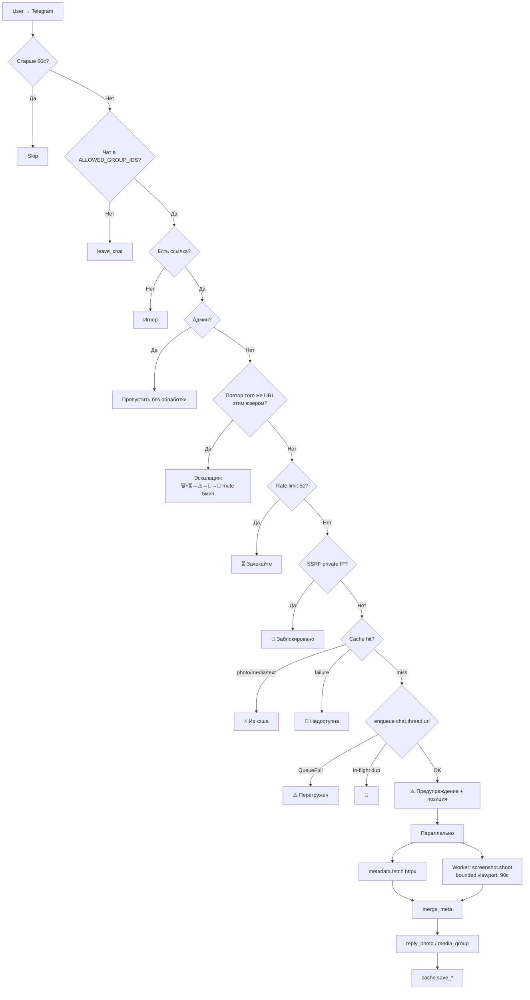

# 🛡️ Telegram Screenshot Bot

[](https://www.python.org/)
[](https://www.docker.com/)
[](https://playwright.dev/)
[](LICENSE)
[](https://github.com/Tosik017/tg-screenshot-bot-1/releases/tag/stable-v4)

Telegram-бот для **безопасного предпросмотра ссылок** и **модерации спама** в группах. Вместо перехода по подозрительной ссылке пользователь отправляет её в группу — бот присылает скриншот страницы + карточку с метаданными.

Работает только в разрешённых группах, доверяет админам и гасит спам одинаковыми ссылками вплоть до временного mute. Оптимизирован под **Render Free (512 МБ RAM, 0.1 CPU)**.

---

## ✨ Возможности

### 🚨 Защита пользователя
- **Мгновенное предупреждение** ещё до генерации скриншота
- **SSRF-фильтр** — блокирует приватные IP (`127/8`, `10/8`, `172.16/12`, `192.168/16`, link-local, CGNAT, IPv6 private)
- **Карточка метаданных** (OpenGraph + Twitter + JSON-LD Product): site_name, title, brand, price, rating, description
- **Disclaimer-цитата** в каждой карточке

### 🛡️ Доступ и модерация
- **Привязка к группам** (`ALLOWED_GROUP_IDS`, несколько через запятую) — из любого другого чата бот выходит сам (`my_chat_member`)
- **Доверие админам** — ссылки админов/владельца/анонимных админов не проверяются и не модерируются
- **Анти-спам дубликатов** — повтор одной ссылки одним юзером эскалирует: 🗑 удаление + ⏳ → ⚠️ → 🛑 → 🚫 **реальный mute 5 мин** (`restrictChatMember`, снимает Telegram). Одно уведомление редактируется на месте
- **Reaction 👀** на дубликат, который уже в обработке (другой запрос пришлёт результат)

### ⚡ Smart queue
- Лимит глубины (`MAX_QUEUE_SIZE=10`), глобальный таймаут (`TASK_TIMEOUT_SEC=90`)
- Видимость позиции в очереди
- Дедупликация по `(chat, thread, url)` — тот же URL в другом чате/топике доставляется отдельно
- Единый фоновый воркер (= `SEMAPHORE=1`)

### 💾 Smart cache
- Типизированные записи: `photo` / `media_group` / `text` / `failure`
- Дифференцированный TTL: обычная 1 ч · с ценой 15 мин · Cloudflare-блок 5 мин · negative 3 мин
- Cache hit без повторного httpx; статистика в `/health`

### 🏎️ Производительность
- Параллельный сбор: `metadata.fetch` (httpx) ∥ `screenshot.shoot` (Playwright)
- **Bounded viewport capture** — высота захвата ограничена на уровне браузера (≤ 5120 px), OOM на длинных страницах невозможен
- Browser restart каждые 50 скриншотов; блокировка рекламы/медиа/шрифтов; мобильный viewport 390×844 @2×

### 🛡️ Стабильность
- Rate limit 5 сек/user (только на запросы со ссылкой, не на чат)
- Graceful shutdown (SIGTERM), `/health` (HTTP 503 при деградации), dumb-init, фильтр бэклога 60 сек

### 🧠 Память без БД
Активный mute хранит **Telegram** (`until_date`) — у бота 0 байт. Strikes/дедуп — короткоживущие на **bounded TTLCache** (`maxsize` + `ttl`): не растёт, не пишет на диск, безопасно сбрасывается при рестарте. Никакой базы данных — на Render Free диск ephemeral.

---

## 🏗️ Архитектура



---

## 🛠️ Стек

Python 3.10 · aiogram 3.7.0 · Playwright 1.44.0 · playwright-stealth 1.0.6 · FastAPI 0.111 · uvicorn 0.30 · httpx 0.27 · selectolax 0.3.21 · cachetools 5.3.3 · loguru 0.7.2 · Pillow 10.3.0 · psutil 5.9.8.

---

## 📋 Требования

- Python 3.10+ / Docker 20+
- RAM ≥ 512 МБ, CPU ≥ 1 core
- `BOT_TOKEN` от [@BotFather](https://t.me/BotFather)
- Для модерации: бот — **админ группы** с правами **Delete Messages** + **Ban Users**

---

## 🚀 Быстрый старт

### Docker
```bash
git clone https://github.com/Tosik017/tg-screenshot-bot-1.git
cd tg-screenshot-bot-1
docker build -t tg-screenshot-bot .
docker run -d --name tg-screenshot-bot --restart unless-stopped \
  -e BOT_TOKEN="YOUR_TOKEN" \
  -e ALLOWED_GROUP_IDS="-1001111111111,-1002222222222" \
  -p 8000:8000 tg-screenshot-bot
```

### Локально
```bash
python -m venv venv && source venv/bin/activate
pip install -r requirements.txt
playwright install chromium
export BOT_TOKEN="YOUR_TOKEN"
export ALLOWED_GROUP_IDS="-1001111111111"
python main.py
```

---

## ☁️ Деплой на Render

1. Форк → render.com → New + → Web Service → Docker, branch `main`
2. **Environment**: `BOT_TOKEN`, `ALLOWED_GROUP_IDS` (через запятую)
3. **Health Check Path**: `/health`
4. В группе сделать бота админом с **Delete Messages + Ban Users**

**Как узнать ID группы**: оставить `ALLOWED_GROUP_IDS` пустым, добавить бота в группу, в логах появится `MY_CHAT_MEMBER chat_id=-100…`. Топики указывать не нужно — один ID = вся форум-супергруппа.

⚠️ Render Free: 750 ч/мес · sleep после 15 мин idle · 512 МБ / 0.1 CPU · ephemeral диск.

---

## 🔐 Переменные окружения

| Переменная | Обяз. | Описание | По умолчанию |
|---|---|---|---|
| `BOT_TOKEN` | ✅ | Токен от @BotFather | — |
| `ALLOWED_GROUP_IDS` | ❌ | Разрешённые группы (через запятую/пробел). Пусто = без ограничения | — |
| `ALLOWED_GROUP_ID` | ❌ | Старая одиночная (поддерживается, сливается со списком) | — |
| `PORT` | ❌ | Порт FastAPI (Render задаёт сам) | `8000` |

---

## ⚙️ Ключевые константы

**config.py**: `SEMAPHORE=1`, `TIMEOUT_MS=20000`, `PAUSE_MS=3000`, `CACHE_SIZE=200`.
**bot.py**: `MAX_MSG_AGE=60`, `RATE_LIMIT_SEC=5`, `DUP_WINDOW_SEC=120`, `STRIKE_DECAY_SEC=120`, `BAN_SEC=300`.
**screenshot.py**: `DEVICE_SCALE=2`, viewport `390×844`, `PART_HEIGHT=1280`, `MAX_PARTS=4`, `MAX_HEIGHT=5120` (физ.), `MAX_CAPTURE_HEIGHT=2560` (CSS, граница захвата), `RESTART_EVERY=50`.
**queue_manager.py**: `MAX_QUEUE_SIZE=10`, `TASK_TIMEOUT_SEC=90`.
**cache.py TTL**: photo/media 3600 · text 300 · price 900 · failure 180.

---

## 📝 Реакции бота

| Ситуация | Ответ |
|---|---|
| Нормальная ссылка | Скриншот + карточка |
| Cloudflare-сайт | Только карточка (метаданные через httpx) |
| Cache hit | Мгновенно из кэша |
| URL уже в обработке (другой запрос) | Реакция 👀 |
| Повтор того же URL этим юзером | 🗑 удаление + эскалация ⏳→⚠️→🛑→🚫 mute |
| Очередь полна | `⚠️ Бот зараз перевантажений` |
| Битый URL | `🚫 Сторінка недоступна` |
| Приватный IP | `🚫 Посилання веде на недоступний ресурс` |
| Rate limit (разные ссылки) | `⏳ Зачекайте N сек` (раз за окно) |
| Сообщение админа / без URL / старше 60с | Пропуск |

---

## 🔧 Troubleshooting

**TelegramConflictError при деплое** → Render → Manual Deploy → Deploy latest commit (или пустой коммит).

**Бот не отвечает** → `curl https://api.telegram.org/bot<TOKEN>/getMe` и `curl https://<bot>.onrender.com/health`; смотреть Render Logs.

**Бот молчит в группе** → проверить, что `chat_id` группы в `ALLOWED_GROUP_IDS` (лог `MY_CHAT_MEMBER`). Если ссылка от админа — это by design (доверие админам).

**Дубли не удаляются / нет mute** → бот не админ или нет прав Delete/Ban (в логах `delete skipped` / `mute failed`). Выдать права.

**Cloudflare блокирует скриншот** → метаданные всё равно извлекаются через httpx (`Slackbot-LinkExpanding`), кэш `text` на 5 мин.

**Playwright OOM** → больше не должно случаться (захват ограничен `MAX_CAPTURE_HEIGHT`). Если всё же — снизить `MAX_CAPTURE_HEIGHT`/`MAX_PARTS` или поднять RAM.

---

## 🔒 Безопасность

- SSRF-фильтр приватных IP (известное ограничение: проверка до запроса, без верификации финального URL после редиректов)
- Rate limit + queue depth + task timeout + negative cache + browser restart
- `BOT_TOKEN` только в env, `.env` в `.gitignore`. Бан-mute снимается админом вручную или Telegram по `until_date`

---

## ❓ FAQ

**Долгий ответ?** Cold start Render (~30–60 с) или очередь (показывается позиция).
**Webhook?** Нет, polling надёжнее для free tier.
**PDF?** Нет, только PNG.
**Ограничить доступ?** Уже есть: `ALLOWED_GROUP_IDS` + доверие админам + анти-спам.
**Кэш персистентный?** Нет, в памяти; сбрасывается при рестарте (безопасно).
**Параллельность?** На Render Free `SEMAPHORE=1` обязательно; на VPS 2+ ГБ можно поднять.

---

## ⚠️ Известные ограничения
Кэш/strikes не персистентны · polling (задержка 1–2 с) · Cloudflare частично блокирует скриншот · Render Free спит · SSRF только до редиректов · модерация требует прав бота Delete+Ban.

## 📜 License
MIT — см. [LICENSE](LICENSE).
