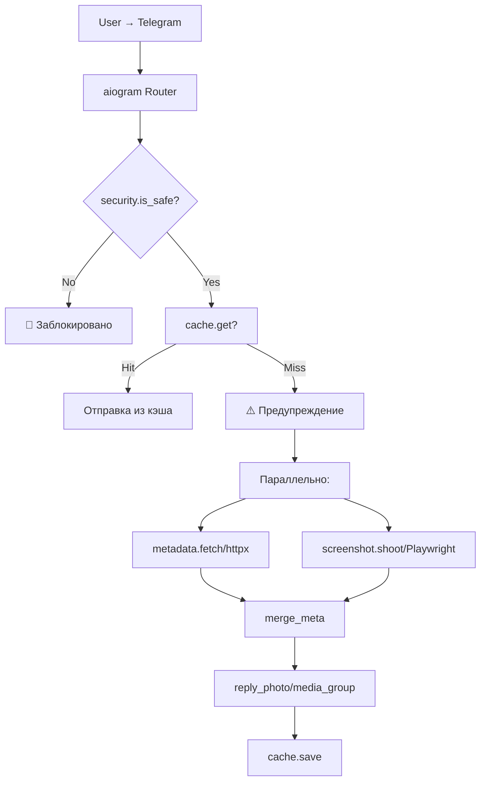

# 🖼️ Telegram Screenshot Bot

Telegram-бот для безопасного предпросмотра ссылок. Отправляет скриншот веб-страницы и текстовую карточку с метаданными, чтобы пользователь не переходил по подозрительным ссылкам.

---

## ✨ Возможности

- 🔗 **Мгновенное предупреждение** — до генерации скриншота бот предупреждает о потенциальной опасности
- 📱 **Мобильный вид** — скриншоты в разрешении 390×844 (@2x) для реалистичного отображения
- 🖼️ **Полная страница** — снимает всю страницу и нарезает на части (до 5120 px)
- 🏷️ **Метаданные** — извлекает title, description, price, brand, rating (JSON-LD Schema.org)
- 🛡️ **SSRF-защита** — блокирует запросы к приватным IP-адресам
- 💾 **Кэширование** — TTLCache для file_id отправленных фото
- 🚫 **Блокировка рекламы** — отключает загрузку трекеров и рекламных скриптов
- 🔧 **Оптимизация под 512 МБ RAM** — SEMAPHORE=1, управление памятью

---

## 🏗️ Архитектура

MIT License

Copyright (c) 2026 Tosik017

Permission is hereby granted, free of charge, to any person obtaining a copy
of this software and associated documentation files (the "Software"), to deal
in the Software without restriction, including without limitation the rights
to use, copy, modify, merge, publish, distribute, sublicense, and/or sell
copies of the Software, and to permit persons to whom the Software is
furnished to do so, subject to the following conditions:

The above copyright notice and this permission notice shall be included in all
copies or substantial portions of the Software.

THE SOFTWARE IS PROVIDED "AS IS", WITHOUT WARRANTY OF ANY KIND, EXPRESS OR
IMPLIED, INCLUDING BUT NOT LIMITED TO THE WARRANTIES OF MERCHANTABILITY,
FITNESS FOR A PARTICULAR PURPOSE AND NONINFRINGEMENT. IN NO EVENT SHALL THE
AUTHORS OR COPYRIGHT HOLDERS BE LIABLE FOR ANY CLAIM, DAMAGES OR OTHER
LIABILITY, WHETHER IN AN ACTION OF CONTRACT, TORT OR OTHERWISE, ARISING FROM,
OUT OF OR IN CONNECTION WITH THE SOFTWARE OR THE USE OR OTHER DEALINGS IN THE
SOFTWARE.

### 📝 In short:

You are free to do almost anything with this software, but there are a few basic rules.

* **You can:** Use, modify, copy, distribute, and even sell the code for any purpose (including commercial projects).
* **You must:** Keep the original copyright notice and the license text included in your project.
* **You cannot:** Hold the author (Tosik017) liable for any damages, bugs, or issues. The software is provided "as is," at your own risk.

> *"Do whatever you want with the code, just give me credit and don't sue me if something breaks."*

📝 Краткий итог:
"Вы можете делать с моим кодом всё, что захотите, в том числе использовать его в коммерческих целях. Просто не удаляйте моё имя из файла лицензии и не вините меня, если из-за моего кода у вас что-то сломается."

