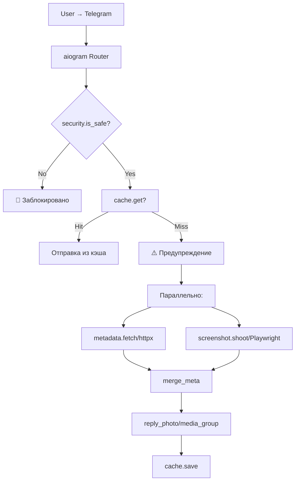
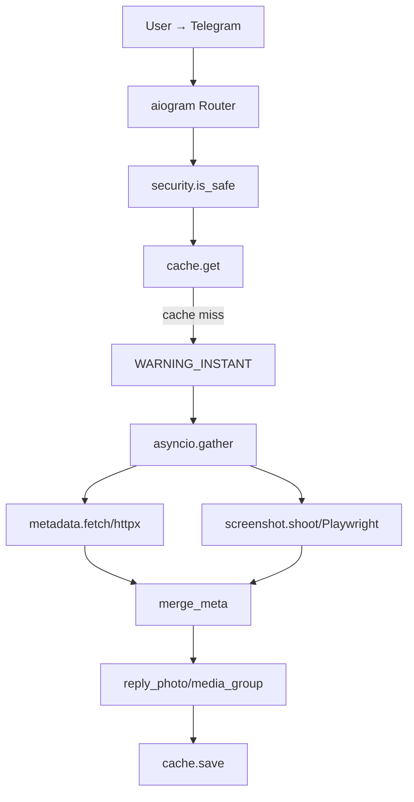

# 🖼️ Telegram Screenshot Bot

[](https://www.python.org/)
[](https://www.docker.com/)
[](https://playwright.dev/)
[](LICENSE)

Telegram-бот для безопасного предпросмотра ссылок. Отправляет скриншот веб-страницы и текстовую карточку с метаданными, чтобы пользователь не переходил по подозрительным ссылкам.

---

## ✨ Возможности

- 🔗 **Мгновенное предупреждение** — до генерации скриншота бот предупреждает о потенциальной опасности
- 📱 **Мобильный вид** — скриншоты в разрешении 390×844 (@2x) для реалистичного отображения
- 🖼️ **Полная страница** — снимает всю страницу и нарезает на части (до 5120 px)
- 🏷️ **Метаданные** — извлекает title, description, price, brand, rating (JSON-LD Schema.org)
- 🛡️ **SSRF-защита** — блокирует запросы к приватным IP-адресам
- 💾 **Кэширование** — TTLCache для file_id отправленных фото
- 🚫 **Блокировка рекламы** — отключает загрузку трекеров и рекламных скриптов
- 🔧 **Оптимизация под 512 МБ RAM** — SEMAPHORE=1, управление памятью

---

## 🏗️ Архитектура



MIT License

Copyright (c) 2026 Tosik017

Permission is hereby granted, free of charge, to any person obtaining a copy
of this software and associated documentation files (the "Software"), to deal
in the Software without restriction, including without limitation the rights
to use, copy, modify, merge, publish, distribute, sublicense, and/or sell
copies of the Software, and to permit persons to whom the Software is
furnished to do so, subject to the following conditions:

The above copyright notice and this permission notice shall be included in all
copies or substantial portions of the Software.

THE SOFTWARE IS PROVIDED "AS IS", WITHOUT WARRANTY OF ANY KIND, EXPRESS OR
IMPLIED, INCLUDING BUT NOT LIMITED TO THE WARRANTIES OF MERCHANTABILITY,
FITNESS FOR A PARTICULAR PURPOSE AND NONINFRINGEMENT. IN NO EVENT SHALL THE
AUTHORS OR COPYRIGHT HOLDERS BE LIABLE FOR ANY CLAIM, DAMAGES OR OTHER
LIABILITY, WHETHER IN AN ACTION OF CONTRACT, TORT OR OTHERWISE, ARISING FROM,
OUT OF OR IN CONNECTION WITH THE SOFTWARE OR THE USE OR OTHER DEALINGS IN THE
SOFTWARE.


### 📝 In short:

You are free to do almost anything with this software, but there are a few basic rules.

* **You can:** Use, modify, copy, distribute, and even sell the code for any purpose (including commercial projects).
* **You must:** Keep the original copyright notice and the license text included in your project.
* **You cannot:** Hold the author (Tosik017) liable for any damages, bugs, or issues. The software is provided "as is," at your own risk.

> *"Do whatever you want with the code, just give me credit and don't sue me if something breaks."*

---

📝 Краткий итог:
"Вы можете делать с моим кодом всё, что захотите, в том числе использовать его в коммерческих целях. Просто не удаляйте моё имя из файла лицензии и не вините меня, если из-за моего кода у вас что-то сломается."

---

  # Глубокое техническое исследование репозитория tg-screenshot-bot-1

## 1. Краткое резюме исследования

**Репозиторий**: [Tosik017/tg-screenshot-bot-1](https://github.com/Tosik017/tg-screenshot-bot-1) — Telegram-бот для безопасного предпросмотра ссылок, разработанный специально для развёртывания на Render Free (512 МБ RAM). Бот использует архитектуру с параллельным сбором метаданных (httpx) и скриншотов (Playwright), отправляет пользователю предупреждение до обработки, а затем — скриншот страницы с текстовой карточкой.

**Ключевые находки**:
- Проект оптимизирован под ограниченные ресурсы: SEMAPHORE=1, нарезка скриншотов на части (макс. 5120 px), блокировка рекламы и медиа
- Использует проверенный паттерн `dumb-init` для предотвращения zombie-процессов Playwright
- SSRF-фильтр реализован базово (нет защиты от DNS rebinding)
- Нет персистентного кэша, rate limiting, healthcheck для бота, тестов, CI/CD

**Рекомендуемый деплой**: Render Free (для тестирования) → Oracle Cloud Always Free ARM (для production 24/7) → Hetzner CX22 (для стабильного production)

---

## 2. Технический аудит проекта

### 2.1. Архитектура проекта



### 2.2. Назначение файлов

| Файл | Размер | Назначение |
|------|--------|------------|
| `bot.py` | 9,506 B | Основная логика бота: обработка сообщений, парсинг URL, построение ответа, кэширование |
| `main.py` | 1,144 B | Точка входа: инициализация Playwright, запуск aiogram polling + FastAPI сервер |
| `screenshot.py` | 6,220 B | Playwright-логика: headless Chromium, нарезка скриншотов, блокировка рекламы |
| `metadata.py` | 4,575 B | Парсинг метаданных: httpx, selectolax, JSON-LD schema.org Product |
| `security.py` | 571 B | SSRF-фильтр: блокировка private IP ranges |
| `cache.py` | 330 B | In-memory TTLCache для file_id Telegram |
| `config.py` | 452 B | Конфигурация: env vars, константы |
| `Dockerfile` | 323 B | Multi-stage Docker с Playwright base image |
| `render.yaml` | 155 B | Render Blueprint для деплоя |
| `requirements.txt` | 187 B | Зависимости Python |
| `TZ.md` | 14,097 B | Техническое задание v4.1 |

### 2.3. Dependency Tree

```
aiogram 3.7.0 (async Telegram Bot API)
├── aiohttp (async HTTP client)
├── magic-filter (callback queries)
├── pyrogram (optional, not used here)
├── certifi (SSL certificates)

playwright 1.44.0 (headless browser automation)
├── playwright-stealth 1.0.6 (anti-detection)

fastapi 0.111.0 + uvicorn 0.30.0 (HTTP server for /ping)
├── starlette
├── pydantic

cachetools 5.3.3 (LRU/TTL cache)
loguru 0.7.2 (structured logging)
psutil 5.9.8 (memory monitoring)
httpx 0.27.0 (async HTTP client)
selectolax 0.3.21 (HTML parser, C-extension)
Pillow 10.3.0 (image processing)
```

### 2.4. Docker-конфигурация

**Dockerfile**:
- Base: `mcr.microsoft.com/playwright/python:v1.44.0-jammy` (Ubuntu 22.04 + Playwright deps)
- Добавляет `dumb-init` — **критически важно** для предотвращения zombie-процессов Chromium
- `playwright install chromium` — устанавливает браузер в образ (~150 МБ)

**Оценка**: ✅ Правильный base image, использование dumb-init, минимальные слои.

**render.yaml**:
- Web service, runtime: docker
- Health check: `/ping`
- Env var: `BOT_TOKEN` (sync: false — не показывать в dashboard)

### 2.5. Требования к окружению

| Параметр | Значение | Примечание |
|----------|----------|------------|
| Python | 3.12 | Указан в TZ.md |
| BOT_TOKEN | env required | From @BotFather |
| PORT | 8000 default | FastAPI server |
| RAM | ≥512 МБ | Render Free минимум |
| CPU | ≥1 core | Playwright требователен |
| Network | outbound HTTPS | Для Telegram API и целевых сайтов |

### 2.6. Потенциальные проблемы деплоя

| Проблема | Уровень | Описание |
|----------|---------|----------|
| **Playwright zombie процессы** | Высокий | Без `dumb-init` Chromium остаётся zombie после browser.close() [GitHub Issue #34190](https://github.com/microsoft/playwright/issues/34190) |
| **Memory leaks** | Высокий | Playwright накапливает память; рекомендуется periodic browser restart [GitHub Issue #15400](https://github.com/microsoft/playwright/issues/15400) |
| **SSRF race condition** | Средний | `socket.gethostbyname()` и реальный запрос Playwright — разные моменты; возможен DNS rebinding |
| **Render spin-down** | Средний | Free tier: 15 мин idle → sleep; cold start ~30-60 сек |
| **No healthcheck for bot** | Средний | `/ping` проверяет только FastAPI, не сам бот |
| **No rate limiting** | Средний | Нет защиты от флуда пользователей |
| **MAX_MSG_AGE=60** | Низкий | Пропускает старые сообщения, но не защищает от очереди при рестарте |

### 2.7. RAM/CPU профиль

| Сценарий | RAM | CPU |
|----------|-----|-----|
| Idle (Chromium запущен) | ~250-350 МБ | ~1-2% |
| Один скриншот (mobile, full-page) | +100-150 МБ | 50-100% на время рендера |
| Пик (SEMAPHORE=1, всегда) | ~512 МБ | 100% |
| Рекомендуемый лимит | 1 ГБ | 1 vCPU |

### 2.8. Безопасность

**SSRF-фильтр (`security.py`)**:
- Блокирует: 127.0.0.0/8, 10.0.0.0/8, 172.16.0.0/12, 192.168.0.0/16, link-local, multicast, IPv6 private
- **Проблема**: Только DNS lookup, нет проверки после редиректов
- **Рекомендация**: Добавить фильтрацию URL после `httpx` редиректов

**Bot Token**:
- Читается из env, не в коде — ✅
- Нет ротации при утечке — ⚠️

---

## 3. Лучшие реальные аналоги

| Проект | ⭐ Stars | Последний коммит | Технологии | Что делает лучше | Что заимствовать |
|--------|---------|------------------|------------|------------------|------------------|
| **[Web-Screenshot-Bot](https://github.com/alenpaulvarghese/Web-Screenshot-Bot)** | ~86 | 2023 | aiogram, Playwright, Pyrogram | Множество форматов (PNG/JPEG/PDF), разные разрешения, splitting long pages | Поддержка PDF экспорта, конфигурация через Poetry |
| **[TeleWebSaver](https://github.com/mahdidehghandev/TeleWebSaver)** | ~10 | 2024 | aiogram v3, Playwright, SearxNG | Интеграция с поиском, PDF экспорт, inline кнопки | Архитектура с inline-кнопками для выбора результатов |
| **[Gotenberg](https://github.com/gotenberg/gotenberg)** | ~7k | 2024 | Go, Chromium, LibreOffice | Production-ready API, масштабируемость, очереди, множество форматов | Архитектура очередей, health checks, метрики |
| **[Browserless](https://github.com/browserless/browserless)** | ~6k | 2024 | Node.js, Puppeteer/Playwright | Managed browser service, parallelism, ARM64, debugging | Паттерн managed browser pool, session management |
| **[nuhmanpk/WebScrapper](https://github.com/nuhmanpk/WebScrapper)** | ~50 | 2024 | aiogram, Playwright | Web scraping с сохранением в разные форматы | Логика скрапинга и сохранения |
| **[ramizeid/Python-Discord-Screenshot-Bot](https://github.com/ramizeid/Python-Discord-Screenshot-Bot)** | ~20 | 2022 | Selenium | Discord-интеграция | Пример другой платформы |
| **[KnorpelSenf/link-preview-bot](https://github.com/KnorpelSenf/link-preview-bot)** | ~30 | 2023 | TypeScript | TypeScript реализация | Альтернативный стек |
| **[tg-screenshot-bot](https://github.com/Tosik017/tg-screenshot-bot-1)** | 0 | 2026 | aiogram, Playwright, FastAPI | Оптимизация под 512 МБ RAM, предупреждение до генерации, защита от бэклога | — |

### Анализ лучших практик из аналогов:

**From Web-Screenshot-Bot**:
- Использование `poetry` для dependency management
- Поддержка разных форматов (PDF, PNG, JPEG)
- Разные разрешения скриншотов (800x600 до 2560x1440)
- Splitting long pages (аналогичная реализация через Pillow)

**From Gotenberg**:
- REST API архитектура (в данном проекте: FastAPI только для healthcheck)
- Queue-based processing с rate limiting
- Health checks и readiness probes
- Graceful shutdown

**From Browserless**:
- Browser pool pattern (в данном проекте: один global browser)
- Session management и cleanup
- ARM64 поддержка (важно для Oracle Cloud)

---

## 4. Сравнение вариантов деплоя

| Платформа | Сложность | $/мес | Лимиты | Стабильность | Playwright | Рекомендация |
|-----------|-----------|-------|--------|--------------|------------|--------------|
| **[Render Free](https://render.com/docs/free)** | ⭐ | $0 | 750 часов/мес, sleep после 15 мин idle, 512 МБ RAM | Низкая (cold start) | ✅ | ✅ Только для тестирования |
| **Docker локально** | ⭐⭐ | $0 | Лимиты локальной машины | Высокая | ✅ | ✅ Для разработки |
| **Docker Compose** | ⭐⭐ | $0 | Лимиты локальной машины | Высокая | ✅ | ✅ Для разработки и тестирования |
| **VPS Ubuntu** | ⭐⭐⭐ | $5-10 | Зависит от провайдера | Высокая | ✅ | ✅ Для production |
| **[Hetzner CX22](https://www.hetzner.com/cloud)** | ⭐⭐⭐ | €5.99 (~$6.99) | 2 vCPU, 4 ГБ RAM, 20 ГБ SSD | Высокая | ✅ | ✅✅ Лучший price/performance |
| **[Oracle Cloud Always Free](https://www.oracle.com/cloud/free/)** | ⭐⭐⭐⭐ | $0 | 4 ARM OCPU, 24 ГБ RAM, 200 ГБ storage | Высокая | ⚠️ (ARM) | ✅✅ Бесплатный production |
| **[Fly.io](https://fly.io/pricing/)** | ⭐⭐⭐ | $5+ | Убрали free tier, 2-часовой trial | Средняя | ✅ | ⚠️ Не рекомендуется (нет free tier) |
| **[Railway](https://railway.com/pricing)** | ⭐⭐ | $5+ | $5 минимум, usage-based | Средняя | ✅ | ⚠️ Можно использовать |
| **[Coolify](https://coolify.io/)** | ⭐⭐⭐⭐ | $0 (self-hosted) | Зависит от VPS | Высокая | ✅ | ✅ Для multi-app deployment |
| **Self-hosted (Raspberry Pi)** | ⭐⭐⭐⭐⭐ | $0 | 4-8 ГБ RAM, ARM | Средняя | ⚠️ (ARM) | ⚠️ Playwright требователен |

### Детальное сравнение:

#### 1. Render Free [Render Docs](https://render.com/docs/free)
- **Стоимость**: $0
- **Лимиты**: 750 часов/месяц (~31 день для 1 сервиса), sleep после 15 мин idle, 512 МБ RAM, 0.1 CPU
- **Проблемы**: Cold start 30-60 сек, может убить процесс при превышении памяти
- **Playwright**: Работает, но требует оптимизации (SEMAPHORE=1)
- **Рекомендация**: Только для тестирования, не для production 24/7

#### 2. Hetzner Cloud [Hetzner Cloud](https://www.hetzner.com/cloud)
- **Стоимость**: €5.99/мес (~$6.99) для CX22 (2 vCPU, 4 ГБ RAM)
- **Лимиты**: Мощность выбранного тарифа
- **Преимущества**: Отличный price/performance, GDPR-compliant, стабильность
- **Playwright**: Работает отлично на x86
- **Рекомендация**: ✅✅ Лучший выбор для стабильного production

#### 3. Oracle Cloud Always Free [Oracle Free Tier](https://www.oracle.com/cloud/free/)
- **Стоимость**: $0 (Always Free tier)
- **Лимиты**: 4 ARM Ampere A1 OCPU, 24 ГБ RAM, 200 ГБ storage
- **Ограничения**: ARM архитектура — требует дополнительной настройки Playwright
- **Playwright**: Требует `playwright install chromium` с ARM-сборкой
- **Рекомендация**: ✅✅ Бесплатный production, но требует больше настройки

#### 4. Fly.io [Fly.io Pricing](https://fly.io/pricing/)
- **Стоимость**: Убрали free tier для новых пользователей, $5 кредитов при регистрации
- **Лимиты**: Usage-based pricing
- **Проблемы**: Нет бесплатного tier для постоянной работы
- **Рекомендация**: ⚠️ Не рекомендуется для этого проекта

#### 5. Railway [Railway Pricing](https://railway.com/pricing)
- **Стоимость**: $5/мес минимум (Hobby plan)
- **Лимиты**: $5 кредитов включено, далее usage-based
- **Проблемы**: Может стать дорожше при высокой нагрузке
- **Рекомендация**: ⚠️ Можно использовать, но Hetzner дешевле

#### 6. Coolify [Coolify Docs](https://coolify.io/docs/get-started/installation)
- **Стоимость**: $0 (self-hosted)
- **Требования**: 2 CPU, 2 ГБ RAM для самого Coolify
- **Преимущества**: Heroku-like experience, auto-deploy, SSL
- **Рекомендация**: ✅ Для multi-app deployment, если уже есть VPS

---

## 5. Лучшие практики эксплуатации

### 5.1. Мониторинг

**Uptime Kuma** [GitHub](https://github.com/louislam/uptime-kuma):
```bash
docker run -d --restart=always -p 3001:3001 -v uptime-kuma:/app/data --name uptime-kuma louislam/uptime-kuma:latest
```
- HTTP checks на `/ping` endpoint
- Telegram notifications при downtime

**Healthchecks.io**:
- Пинг бота каждые 5 минут
- Если бот не отвечает — алерт

### 5.2. Логирование

**Loguru** (уже используется):
```python
from loguru import logger
import sys

logger.remove()
logger.add(sys.stdout, format="{time} | {level} | {message}")
logger.add("file_{time}.log", rotation="1 day", retention="7 days")
```

**Для production**: Loki + Promtail [Grafana Loki](https://grafana.com/oss/loki/)

### 5.3. Health Checks

**FastAPI endpoint** (уже есть):
```python
@app.get("/health")
async def health():
    return {
        "status": "ok",
        "bot": "connected",  # Проверка фактического состояния бота
        "browser": _browser is not None,
        "timestamp": datetime.utcnow().isoformat()
    }
```

### 5.4. Авто-перезапуск

**Docker Compose**:
```yaml
services:
  bot:
    restart: unless-stopped
    mem_limit: 512m
```

**systemd**:
```ini
[Service]
Restart=always
RestartSec=5
```

### 5.5. Защита от утечек памяти Playwright

**Periodic browser restart**:
```python
_request_count = 0
_MAX_REQUESTS_PER_BROWSER = 100

async def shoot(url: str):
    global _request_count
    _request_count += 1
    
    if _request_count >= _MAX_REQUESTS_PER_BROWSER:
        await _browser.close()
        await init()  # Перезапуск
        _request_count = 0
```

**dumb-init** (уже используется) — предотвращает zombie процессы [GitHub Issue #34190](https://github.com/microsoft/playwright/issues/34190)

### 5.6. SSRF защита

**Улучшенная версия**:
```python
import httpx

async def is_safe(url: str) -> bool:
    # Проверка перед запросом
    if not _is_safe_host(url):
        return False
    
    # Проверка после редиректов
    async with httpx.AsyncClient(follow_redirects=True) as client:
        r = await client.head(url, timeout=5)
        final_url = str(r.url)
        return _is_safe_host(final_url)
```

### 5.7. Rate Limiting

**aiogram rate limiter**:
```python
from aiogram.dispatcher.middlewares import BaseMiddleware

class RateLimitMiddleware(BaseMiddleware):
    def __init__(self, limit: int = 1, interval: int = 5):
        self.limit = limit
        self.interval = interval
        self.storage = {}
    
    async def __call__(self, handler, event, data):
        user_id = event.from_user.id
        now = time.time()
        
        if user_id in self.storage:
            if now - self.storage[user_id] < self.interval:
                await event.reply("⏳ Подождите немного...")
                return
        
        self.storage[user_id] = now
        return await handler(event, data)
```

---

---

## 🛠️ Стек технологий

| Компонент | Версия | Зачем |
|-----------|--------|-------|
| Python | 3.12 | Базовый язык |
| aiogram | 3.7.0 | Telegram Bot API, async-first |
| Playwright | 1.44.0 | Headless Chromium для скриншотов |
| playwright-stealth | 1.0.6 | Скрытие признаков headless-браузера |
| FastAPI | 0.111.0 | HTTP-сервер для health check |
| uvicorn | 0.30.0 | ASGI server |
| httpx | 0.27.0 | Асинхронный HTTP для метаданных |
| selectolax | 0.3.21 | C-парсер HTML (30× быстрее BeautifulSoup) |
| cachetools | 5.3.3 | In-memory TTL кэш |
| loguru | 0.7.2 | Структурированное логирование |
| Pillow | 10.3.0 | Нарезка скриншотов |
| psutil | 5.9.8 | Мониторинг RAM |

---

## 📋 Требования

- **Python**: 3.12+
- **Docker**: 20+ (для контейнерного запуска)
- **RAM**: ≥512 МБ (минимум для Render Free)
- **CPU**: ≥1 core (для Playwright)
- **Переменные окружения**: `BOT_TOKEN` (обязательно)

---

## 🚀 Быстрый старт

### Docker (рекомендуется)

```bash
# 1. Клонирование
git clone https://github.com/Tosik017/tg-screenshot-bot-1.git
cd tg-screenshot-bot-1

# 2. Сборка образа
docker build -t tg-screenshot-bot .

# 3. Запуск
docker run -d \
  --name tg-screenshot-bot \
  --restart unless-stopped \
  -e BOT_TOKEN="YOUR_BOT_TOKEN_HERE" \
  -p 8000:8000 \
  tg-screenshot-bot
```

---

## 💻 Локальный запуск

```bash
# 1. Клонирование
git clone https://github.com/Tosik017/tg-screenshot-bot-1.git
cd tg-screenshot-bot-1

# 2. Создание виртуального окружения
python -m venv venv
source venv/bin/activate  # Windows: venv\Scripts\activate

# 3. Установка зависимостей
pip install -r requirements.txt

# 4. Установка браузера Playwright
playwright install chromium

# 5. Настройка переменных окружения
export BOT_TOKEN="YOUR_BOT_TOKEN_HERE"
export PORT=8000  # опционально, по умолчанию 8000

# 6. Запуск
python main.py
```

---

## 🐳 Docker Compose

```yaml
version: '3.8'

services:
  bot:
    build: .
    container_name: tg-screenshot-bot
    restart: unless-stopped
    mem_limit: 512m
    environment:
      - BOT_TOKEN=${BOT_TOKEN}
      - PORT=8000
    ports:
      - "8000:8000"
    healthcheck:
      test: ["CMD", "curl", "-f", "http://localhost:8000/ping"]
      interval: 30s
      timeout: 10s
      retries: 3
      start_period: 40s
```

```bash
docker-compose up -d
```

---

## ☁️ Деплой на Render

### Через Blueprint (render.yaml)

1. Форкните репозиторий на GitHub
2. Перейдите на [render.com](https://render.com)
3. Нажмите "New +" → "Web Service"
4. Выберите ваш форк
5. В разделе **Environment** добавьте:
   - `BOT_TOKEN` = ваш токен от @BotFather
6. Нажмите "Create Web Service"

### Вручную

1. Создайте новый Web Service
2. Runtime: **Docker**
3. Branch: `main`
4. Environment:
   - `BOT_TOKEN` = ваш токен
5. Health Check Path: `/ping`

⚠️ **Важно**: Render Free tier имеет ограничения:
- 750 часов/месяц (~31 день для 1 сервиса)
- Sleep после 15 минут idle
- Cold start ~30-60 секунд

---

## 🖥️ Деплой на VPS (Ubuntu 22.04)

### 1. Установка Docker

```bash
sudo apt update
sudo apt install -y docker.io docker-compose
sudo systemctl enable docker
sudo systemctl start docker
```

### 2. Клонирование и запуск

```bash
git clone https://github.com/Tosik017/tg-screenshot-bot-1.git
cd tg-screenshot-bot-1

# Создание .env файла
echo "BOT_TOKEN=YOUR_BOT_TOKEN_HERE" > .env

docker-compose up -d
```

### 3. Systemd сервис (опционально)

```bash
sudo nano /etc/systemd/system/tg-screenshot-bot.service
```

```ini
[Unit]
Description=Telegram Screenshot Bot
After=docker.service
Requires=docker.service

[Service]
Type=oneshot
RemainAfterExit=yes
WorkingDirectory=/home/user/tg-screenshot-bot-1
ExecStart=/usr/bin/docker-compose up -d
ExecStop=/usr/bin/docker-compose down
TimeoutStartSec=0

[Install]
WantedBy=multi-user.target
```

```bash
sudo systemctl enable tg-screenshot-bot
sudo systemctl start tg-screenshot-bot
```

---

## 🔐 Переменные окружения

| Переменная | Обязательная | Описание | По умолчанию |
|------------|--------------|----------|--------------|
| `BOT_TOKEN` | ✅ | Токен от @BotFather | — |
| `PORT` | ❌ | Порт для FastAPI сервера | `8000` |

---

## 🤖 Получение Telegram Bot Token

1. Откройте Telegram и найдите [@BotFather](https://t.me/BotFather)
2. Отправьте команду `/newbot`
3. Следуйте инструкциям: укажите имя бота и username (должен заканчиваться на `bot`)
4. Скопируйте полученный токен (формат: `123456789:ABCdefGHIjklMNOpqrsTUVwxyz`)
5. Добавьте его в переменные окружения

---

## 📝 Примеры использования

### Базовый сценарий

1. Отправьте боту ссылку: `https://example.com`
2. Бот мгновенно отвечает предупреждением: "⚠️ СТОП! НЕ ПЕРЕХОДЬТЕ ЗА ПОСИЛАННЯМ!"
3. Через 30-90 секунд (в зависимости от сайта) получаете:
   - Скриншот страницы (может быть несколько частей для длинных страниц)
   - Текстовую карточку с title, price, brand, rating
   - Предупреждение в виде цитаты

### Обработка разных типов сайтов

- **E-commerce**: Извлекает цену, бренд, рейтинг (JSON-LD Schema.org Product)
- **Новости**: Извлекает заголовок, описание, изображение (OpenGraph)
- **Cloudflare**: Если скриншот не получается — отправляет только текстовую карточку

---

## 📁 Структура проекта

```
tg-screenshot-bot-1/
├── bot.py              # Основная логика бота
├── main.py             # Точка входа, FastAPI сервер
├── screenshot.py       # Playwright, скриншоты, нарезка
├── metadata.py         # Парсинг метаданных (httpx, selectolax)
├── security.py         # SSRF-защита
├── cache.py            # In-memory кэш
├── config.py           # Конфигурация
├── Dockerfile          # Docker образ
├── docker-compose.yml  # Docker Compose конфиг
├── render.yaml         # Render Blueprint
├── requirements.txt    # Python зависимости
├── TZ.md               # Техническое задание
└── README.md           # Этот файл
```

---

## 🔧 Troubleshooting

### Проблема: Port scan timeout на Render

**Причина**: Render не обнаружил открытый порт в течение 15 минут

**Решение**:
- Убедитесь, что `PORT` env var установлен
- Проверьте, что FastAPI сервер слушает `0.0.0.0:PORT`
- Проверьте health check endpoint `/ping`

### Проблема: Playwright OOM (Out of Memory)

**Причина**: Скриншот слишком длинный или много параллельных запросов

**Решение**:
- Уменьшите `MAX_PARTS` в `screenshot.py` (по умолчанию 4)
- Увеличьте RAM на сервере (минимум 512 МБ)
- Добавьте `mem_limit` в Docker Compose

### Проблема: Cloudflare блокирует скриншоты

**Причина**: Playwright не проходит Cloudflare detection

**Решение**:
- Убедитесь, что `playwright-stealth` установлен
- Для метаданных используется обход через Slackbot User-Agent (уже реализовано)
- Для скриншотов — используйте residential proxy (платно)

### Проблема: Зомби-процессы Chromium

**Причина**: Playwright оставляет zombie-процессы headless_shell

**Решение**:
- Убедитесь, что `dumb-init` установлен в Dockerfile (уже есть)
- Добавьте periodic browser restart (см. рекомендуемые улучшения)

### Проблема: Бот не отвечает после деплоя

**Причина**: Неправильный BOT_TOKEN или бот уже запущен где-то ещё

**Решение**:
- Проверьте токен: `curl https://api.telegram.org/bot<TOKEN>/getMe`
- Убедитесь, что нет другого running instance
- Проверьте логи: `docker logs tg-screenshot-bot`

---

## ❓ FAQ

**Q: Почему бот иногда долго отвечает?**  
A: На Render Free tier происходит "cold start" после 15 минут idle (~30-60 сек). Также первый скриншот требует запуска браузера.

**Q: Можно ли использовать webhook вместо polling?**  
A: Технически да, но на Render Free это сложнее (требует постоянного доступа). Polling более надёжен для free tier.

**Q: Поддерживает ли бот PDF?**  
A: Нет, текущая версия только PNG. См. [Web-Screenshot-Bot](https://github.com/alenpaulvarghese/Web-Screenshot-Bot) для PDF.

**Q: Можно ли ограничить доступ только для определённых пользователей?**  
A: Нет, текущая версия публичная. Добавьте проверку `message.from_user.id` в `bot.py`.

**Q: Как долго хранится кэш?**  
A: 300 секунд (5 минут), 200 записей. Нет персистентности между рестартами.

**Q: Работает ли на ARM (Raspberry Pi, Oracle Cloud)?**  
A: Требует дополнительной настройки Playwright для ARM. См. раздел деплоя на Oracle Cloud.

**Q: Можно ли использовать несколько параллельных запросов?**  
A: На Render Free `SEMAPHORE=1` для экономии RAM. На более мощных серверах можно увеличить.

**Q: Как обновить бота?**  
A: Для Docker: `docker-compose pull && docker-compose up -d`. Для Render: автоматически при push в репозиторий.

**Q: Что делать при утечке токена?**  
A: Удалите бота через @BotFather → `/deletebot`, создайте нового, обновите env var.

---

## ⚠️ Ограничения

- **1 параллельный запрос**: `SEMAPHORE=1` для экономии RAM на Render Free
- **Максимальная высота скриншота**: 5120 px (4 части по 1280 px)
- **Нет персистентного кэша**: При рестарте кэш сбрасывается
- **Нет webhook**: Используется polling (может иметь задержки)
- **Нет rate limiting**: Нет защиты от флуда пользователей
- **Render Free спит**: После 15 минут idle cold start ~30-60 сек

---

## 🔒 Безопасность

### SSRF-защита

Бот блокирует запросы к приватным IP-адресам:
- 127.0.0.0/8 (localhost)
- 10.0.0.0/8, 172.16.0.0/12, 192.168.0.0/16 (private networks)
- link-local, multicast, IPv6 private ranges

**Известные ограничения**:
- Проверка только по DNS, возможен DNS rebinding
- Нет проверки после HTTP редиректов

### Защита Bot Token

- Токен хранится в env var, не в коде
- Не коммитьте `.env` файл
- При утечке — создайте нового бота через @BotFather

---

**Сделано с ❤️ для безопасного веб-сёрфинга**

---


